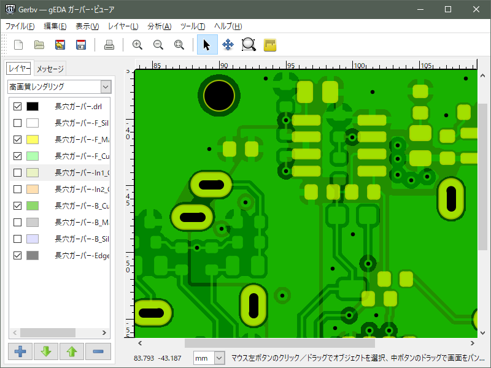

# Gerbv-2.10.0 for windows multilingual -- build tools
---------------------------------------------
## Gerbv-2.10.0 binaries
Executable binaries are in [Releases](https://github.com/kitanokitsune/gerbv_for_win_multilingual/releases) pages.

## Supported features
[These patches](./patch) are applied.
+ Support non-ASCII path and filename
+ Support slotted hole (patch from [sourceforge](https://sourceforge.net/p/gerbv/bugs/258/))

## Build prerequisites
If you want to build __gerbv__ yourself, the followings are required.
+ MSYS2 + binutils + gcc (such as [i686-8.1.0-release-win32-dwarf-rt_v6-rev0](https://sourceforge.net/projects/mingw-w64/files/Toolchains%20targetting%20Win32/Personal%20Builds/mingw-builds/8.1.0/threads-win32/dwarf/i686-8.1.0-release-win32-dwarf-rt_v6-rev0.7z)  / [x86_64-8.1.0-release-win32-seh-rt_v6-rev0](https://sourceforge.net/projects/mingw-w64/files/Toolchains%20targetting%20Win64/Personal%20Builds/mingw-builds/8.1.0/threads-win32/seh/x86_64-8.1.0-release-win32-seh-rt_v6-rev0.7z) ) + etc.
+ [gerbv-2.10.0.tar.gz](https://github.com/gerbv/gerbv/releases/tag/v2.10.0) source file
+ [dxflib-3.26.4-src.tar.gz](https://qcad.org/en/dxflib-downloads) source file
+ [gtk+-2.24.33](https://github.com/kitanokitsune/gtk2.24-win-static-library-builder/releases) library

## How to build Gerbv-2.10.0 for win multilingual
1. Extract or `git pull` this project into some directory.
2. Put **dxflib-3.26.4-src.tar.gz** and **gerbv-2.10.0.tar.gz** into the above directory.
3. Edit **Makefile** as you need.
4. Execute command `make` in the directory.
